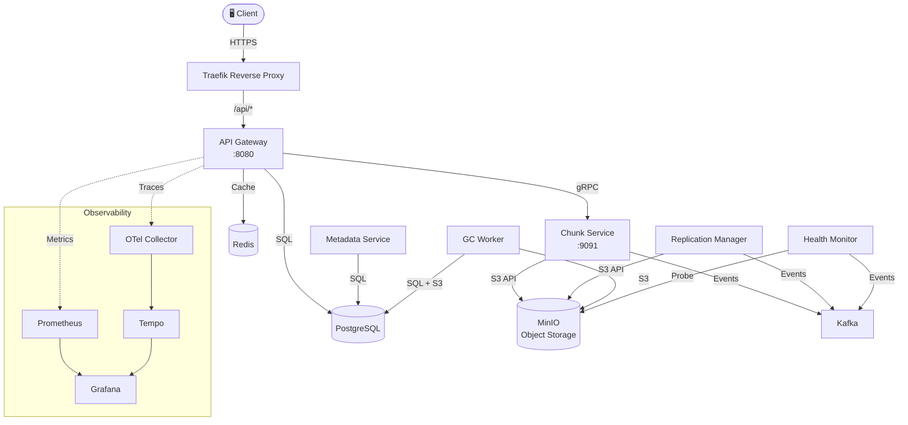

<div align="center">

# 📦 DFMS — Distributed File Management System

**A production-grade distributed file storage platform built in Go, featuring content-defined chunking, deduplication, consistent hashing, and multi-node replication.**

[](https://github.com/AnirudhSinghRajora/dfms/actions)
[](https://go.dev)
[](LICENSE)

</div>

---

## 🏗️ Architecture



DFMS splits files into variable-size chunks using **content-defined chunking (CDC)** with Rabin fingerprinting, deduplicates them via **content-addressable storage (SHA-256)**, and replicates chunks across storage nodes using a **consistent hashing ring**. The system is fully observable with distributed tracing (OpenTelemetry → Tempo) and metrics (Prometheus → Grafana).

---

## ✨ Features

| Category | Feature |
|:---|:---|
| 📤 **Upload** | Chunked upload with CDC, deduplication, integrity verification |
| 📥 **Download** | Streaming reassembly from chunks, checksum validation |
| 🔄 **Multipart** | Large file upload via init → parts → complete flow |
| 📁 **Folders** | Virtual folder hierarchy, move/rename, recursive operations |
| 🔍 **Search** | Full-text search across file names and metadata |
| 📜 **Versioning** | Automatic file versioning, version history, rollback |
| 🔐 **Auth** | ES256 JWT (ECDSA P-256), bcrypt passwords, RBAC middleware |
| ⚡ **Rate Limiting** | Redis sliding-window: global, per-user, per-endpoint tiers |
| 🌐 **Replication** | Consistent hashing ring with virtual nodes, configurable replication factor |
| ♻️ **Garbage Collection** | Two-phase mark-sweep with configurable grace period |
| 🏥 **Health Monitoring** | Active storage node probing, automatic failure detection |
| 📊 **Observability** | OpenTelemetry tracing, Prometheus metrics, Grafana dashboards |
| 🐳 **Containerized** | Multi-stage Docker builds, <20MB images, production Docker Compose |
| 🔄 **CI/CD** | GitHub Actions pipeline: lint → test → build (matrix) |

---

## 🛠️ Tech Stack

| Layer | Technology | Purpose |
|:---|:---|:---|
| Language | Go 1.26 | All services |
| HTTP Framework | Gin | REST API, middleware |
| gRPC | google.golang.org/grpc | Inter-service communication |
| Database | PostgreSQL 16 | Metadata, users, file manifests |
| Cache | Redis 7 | Rate limiting, session cache |
| Object Storage | MinIO | Chunk storage (S3-compatible) |
| Message Queue | Apache Kafka (KRaft) | Async events (replication, GC) |
| Auth | golang-jwt/jwt (ES256) | Access/refresh token pairs |
| Tracing | OpenTelemetry → Tempo | Distributed tracing |
| Metrics | Prometheus → Grafana | System metrics, dashboards |
| Reverse Proxy | Traefik v3 | TLS termination, routing |
| Containerization | Docker + Compose | All services < 20MB |
| CI | GitHub Actions | Lint, test, build matrix |

---

## 🚀 Quick Start

### Prerequisites

- **Go 1.26+** — [install](https://go.dev/dl/)
- **Docker & Docker Compose** — [install](https://docs.docker.com/get-docker/)
- **golang-migrate** — `go install -tags 'postgres' github.com/golang-migrate/migrate/v4/cmd/migrate@latest`

### 1. Clone & Start Infrastructure

```bash
git clone https://github.com/AnirudhSinghRajora/dfms.git
cd dfms

# Start PostgreSQL, Redis, MinIO, Kafka, Prometheus, Grafana
make docker-up
```

### 2. Initialize Database & Keys

```bash
# Apply database migrations
make migrate-up

# Generate JWT signing keys (ES256)
make gen-keys
```

### 3. Build & Run

```bash
# Build all services
make build

# Run the API Gateway (in one terminal)
./bin/api-gateway

# Run the Chunk Service (in another terminal)
./bin/chunk-service

# Run background workers (optional, in separate terminals)
./bin/replication-manager
./bin/gc-worker
./bin/health-monitor
```

### 4. Verify

```bash
# Health check
curl http://localhost:8080/health
# → {"status":"ok"}

# Register a user
curl -X POST http://localhost:8080/api/v1/auth/register \
  -H "Content-Type: application/json" \
  -d '{"email":"demo@example.com","password":"securepass123","display_name":"Demo User"}'
```

### Alternative: Production Mode (All-in-One)

```bash
# Build Docker images + start everything with Traefik
make docker-prod-up
```

---

## 📡 API Reference

Full OpenAPI specification: [`api/openapi/openapi.yaml`](api/openapi/openapi.yaml)

### Authentication

```bash
# Register
curl -X POST http://localhost:8080/api/v1/auth/register \
  -H "Content-Type: application/json" \
  -d '{"email":"user@example.com","password":"mypassword","display_name":"John"}'

# Login
curl -X POST http://localhost:8080/api/v1/auth/login \
  -H "Content-Type: application/json" \
  -d '{"email":"user@example.com","password":"mypassword"}'
# → {"access_token":"eyJ...","refresh_token":"eyJ...","token_type":"Bearer","expires_in":900}

# Save token for subsequent requests
TOKEN="eyJ..."
```

### File Operations

```bash
# Upload a file
curl -X POST http://localhost:8080/api/v1/files/upload \
  -H "Authorization: Bearer $TOKEN" \
  -H "Content-Type: application/octet-stream" \
  -H "X-File-Name: report.pdf" \
  --data-binary @report.pdf

# List files
curl http://localhost:8080/api/v1/files \
  -H "Authorization: Bearer $TOKEN"

# Download a file
curl http://localhost:8080/api/v1/files/{file_id}/download \
  -H "Authorization: Bearer $TOKEN" \
  -o downloaded_report.pdf

# Search files
curl "http://localhost:8080/api/v1/search?q=report" \
  -H "Authorization: Bearer $TOKEN"

# Delete a file
curl -X DELETE http://localhost:8080/api/v1/files/{file_id} \
  -H "Authorization: Bearer $TOKEN"
```

### Multipart Upload (Large Files)

```bash
# 1. Initialize
curl -X POST http://localhost:8080/api/v1/files/upload/multipart/init \
  -H "Authorization: Bearer $TOKEN" \
  -H "Content-Type: application/json" \
  -d '{"file_name":"large_video.mp4","file_size":1073741824}'

# 2. Upload parts
curl -X PUT "http://localhost:8080/api/v1/files/upload/multipart/{upload_id}/part/1" \
  -H "Authorization: Bearer $TOKEN" \
  --data-binary @part1.bin

# 3. Complete
curl -X POST "http://localhost:8080/api/v1/files/upload/multipart/{upload_id}/complete" \
  -H "Authorization: Bearer $TOKEN"
```

---

## ⚙️ Configuration

Configuration is loaded from `configs/config.dev.yaml` (development) or `configs/config.prod.yaml` (production).

All values can be overridden via environment variables:

| Variable | Default | Description |
|:---|:---|:---|
| `DFMS_DATABASE_PASSWORD` | `dfms_dev_password` | PostgreSQL password |
| `DFMS_MINIO_ACCESS_KEY` | `minioadmin` | MinIO access key |
| `DFMS_MINIO_SECRET_KEY` | `minioadmin123` | MinIO secret key |
| `GRAFANA_ADMIN_PASSWORD` | `admin` | Grafana admin password |

Key config sections:

```yaml
chunking:
  min_size: 262144      # 256 KB — minimum chunk size
  avg_size: 1048576     # 1 MB   — target average chunk
  max_size: 4194304     # 4 MB   — maximum chunk size

replication:
  factor: 3             # Store 3 copies of each chunk
  virtual_nodes: 150    # Virtual nodes per physical node

gc:
  scan_interval: 6h     # How often to scan for orphans
  grace_period: 24h     # Wait before deleting orphans
```

---

## 🧪 Testing

```bash
# Unit tests (with race detector)
make test

# Unit tests with HTML coverage report
make test-coverage
# → open coverage.html in browser

# Integration tests (requires Docker)
make test-integration

# Load tests (requires k6 + running DFMS)
make test-load

# Chaos tests (requires Docker + running DFMS)
make test-chaos

# Run everything
make test-all
```

### Test Coverage Highlights

| Package | Coverage |
|:---|:---|
| `internal/config` | 97.3% |
| `internal/ratelimit` | 97.1% |
| `internal/auth` | 80.6% |
| `internal/replication` (hashring) | 100% |

---

## 🐳 Deployment

### Docker Images

All 6 services are built from a single multi-stage Dockerfile:

```bash
# Build all images
make docker-build

# Build a specific service
make docker-build-api-gateway
```

| Service | Image Size |
|:---|:---|
| metadata-service | 10.6 MB |
| chunk-service | 15.6 MB |
| health-monitor | 16.0 MB |
| replication-manager | 16.4 MB |
| gc-worker | 16.9 MB |
| api-gateway | 18.5 MB |

### Production Stack

```bash
# Build + start everything (Traefik + all services + infrastructure)
make docker-prod-up

# View logs
make docker-prod-logs

# Stop
make docker-prod-down
```

The production stack includes:
- **Traefik** reverse proxy with TLS and auto HTTPS redirect
- **Two-tier network**: `frontend` (public) + `backend` (internal-only)
- **Resource limits** per service (CPU + memory)
- **Health checks** on all 15 containers

---

## 📖 Documentation

| Document | Description |
|:---|:---|
| [Architecture](docs/ARCHITECTURE.md) | System design, service responsibilities, data flow |
| [Chunking](docs/CHUNKING.md) | CDC algorithm, deduplication, content-addressable storage |
| [Replication](docs/REPLICATION.md) | Consistent hashing, node failure, garbage collection |
| [Observability](docs/OBSERVABILITY.md) | Tracing, metrics, dashboards, alerting |

---

## 🤝 Contributing

1. Fork the repository
2. Create a feature branch: `git checkout -b feature/my-feature`
3. Write tests for your changes
4. Ensure all tests pass: `make test`
5. Run linting: `make lint`
6. Commit with conventional commits: `feat: add file sharing`
7. Push and open a Pull Request

### Code Style

- Follow [Effective Go](https://go.dev/doc/effective_go)
- All exported functions must have doc comments
- Use `go fmt` and `goimports` (run `make fmt`)
- Minimum 80% test coverage for new packages

---

## 📄 License

This project is licensed under the MIT License — see the [LICENSE](LICENSE) file for details.

---

<div align="center">

**Built with ❤️ in Go**

[Report Bug](https://github.com/AnirudhSinghRajora/dfms/issues) · [Request Feature](https://github.com/AnirudhSinghRajora/dfms/issues) · [Discussions](https://github.com/AnirudhSinghRajora/dfms/discussions)

</div>
