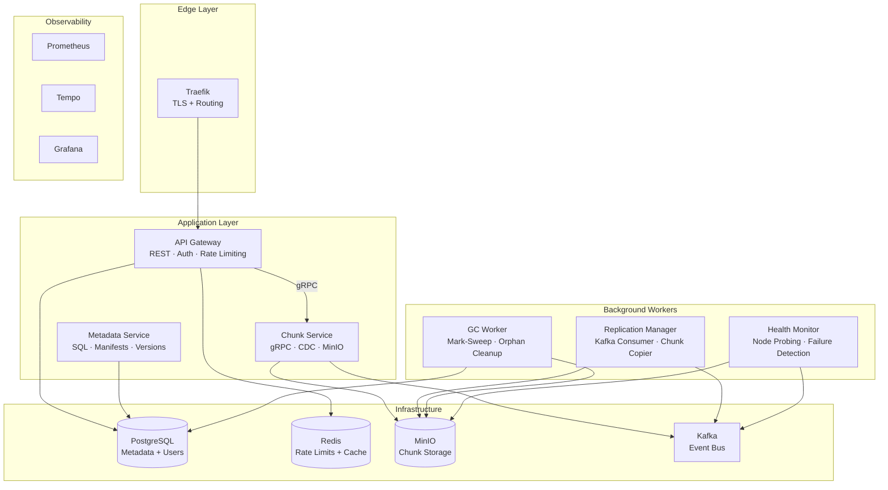
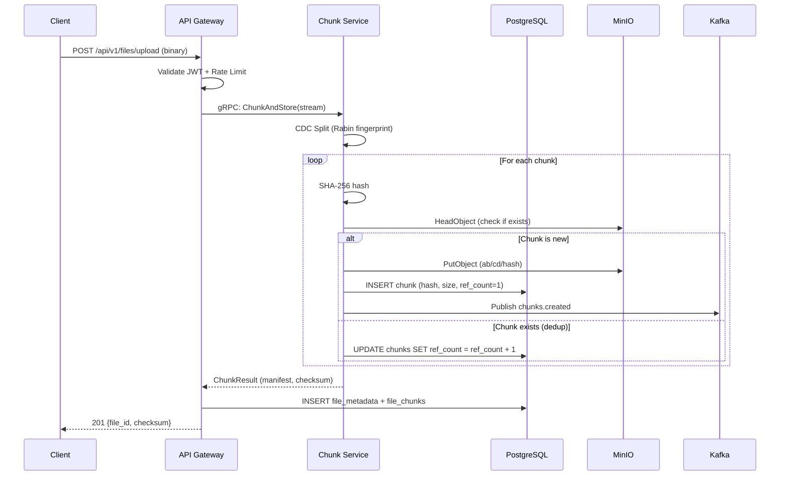
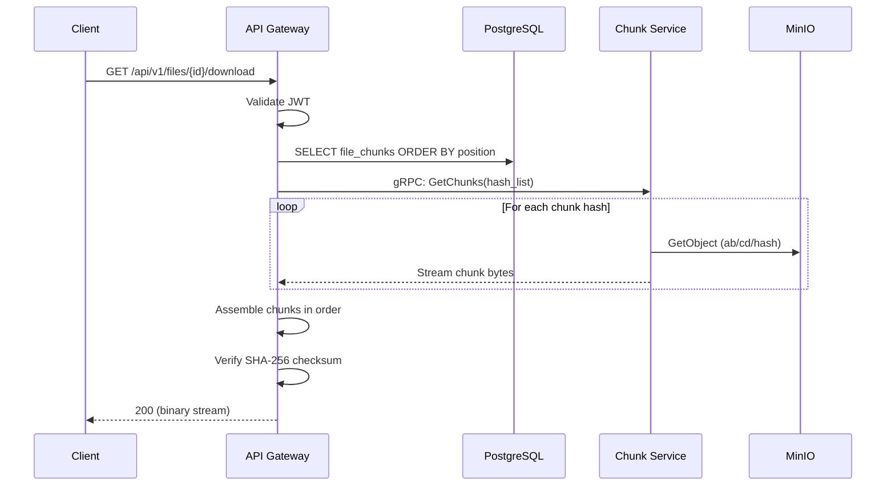
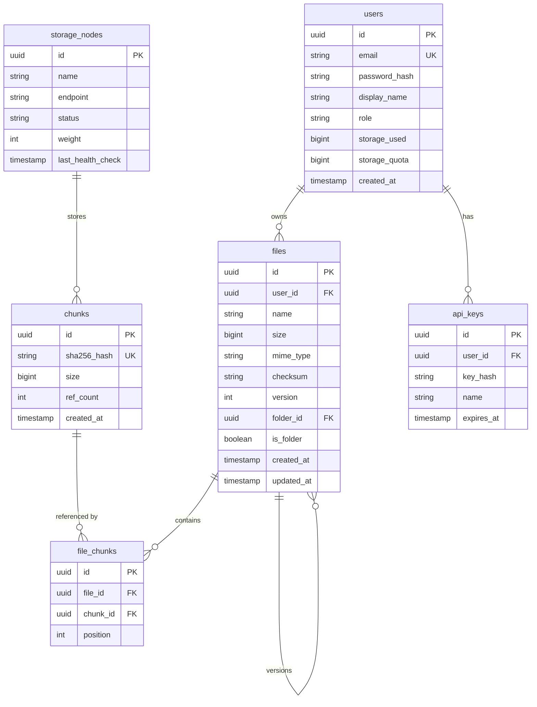

# DFMS Architecture

## Overview

DFMS is a microservice-based distributed file storage platform. Files are split into variable-size chunks, deduplicated, and replicated across storage nodes. The system provides strong consistency for metadata operations and eventual consistency for chunk replication.

## Service Map



## Service Responsibilities

### API Gateway (`:8080`)
The single entry point for all client requests. Handles:
- **Authentication**: ES256 JWT validation, bcrypt password verification
- **Authorization**: Role-based access control (user, admin)
- **Rate Limiting**: Redis sliding-window with global, per-user, and per-endpoint tiers
- **Request Routing**: Forwards chunk operations to Chunk Service via gRPC
- **Metadata CRUD**: Direct PostgreSQL queries for file/folder operations

### Chunk Service (`:9091`)
Data-plane service that handles raw bytes:
- **CDC Splitting**: Rabin fingerprinting to produce variable-size chunks (256KB–4MB)
- **Deduplication**: SHA-256 content-addressed storage — identical chunks stored once
- **MinIO Storage**: Puts/gets chunks using 2-level directory sharding (`ab/cd/hash`)
- **Kafka Events**: Publishes `chunks.created` events for the Replication Manager

### Metadata Service
Manages structured data:
- **File Manifests**: Ordered list of chunk hashes that compose a file
- **Version History**: Tracks all versions of a file with independent chunk references
- **Folder Hierarchy**: Virtual folder tree with parent-child relationships

### Replication Manager
Ensures data durability:
- **Kafka Consumer**: Listens for `chunks.created` and `nodes.health` events
- **Consistent Hashing**: Uses the hash ring to decide which nodes should hold each chunk
- **Chunk Copying**: Copies chunks to replica nodes with bounded concurrency

### GC Worker
Prevents storage leaks:
- **Mark Phase**: Scans for chunks with `ref_count = 0` (no file references them)
- **Grace Period**: Waits 24 hours before deletion (prevents race with concurrent uploads)
- **Sweep Phase**: Deletes orphaned chunks from MinIO and PostgreSQL

### Health Monitor
Detects storage failures:
- **Active Probing**: Periodically reads/writes a test object on each MinIO node
- **Status Updates**: Marks nodes as healthy/unhealthy in PostgreSQL
- **Kafka Events**: Publishes `nodes.health` events to trigger re-replication

---

## Data Flow

### Upload Flow



### Download Flow



---

## Database Schema



---

## Network Architecture

### Development
```
localhost:8080  → API Gateway (Go process)
localhost:9091  → Chunk Service (Go process)
localhost:5432  → PostgreSQL (Docker)
localhost:6379  → Redis (Docker)
localhost:9000  → MinIO (Docker)
localhost:9092  → Kafka (Docker)
localhost:3000  → Grafana (Docker)
localhost:9090  → Prometheus (Docker)
```

### Production (Docker Compose)
```
:443 (HTTPS) → Traefik → dfms-frontend network → API Gateway
                                                      ↕
                          dfms-backend network ← All services + infrastructure
                          (internal, no external access)
```

The backend network is configured as `internal: true`, meaning no container on it can reach the public internet directly. Only Traefik bridges the two networks.
