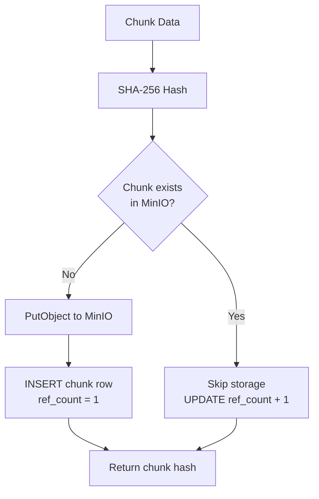

# Content-Defined Chunking & Deduplication

## Overview

DFMS uses **Content-Defined Chunking (CDC)** to split files into variable-size chunks at boundaries determined by the file's content, not by fixed offsets. This ensures that inserting or modifying data in the middle of a file only invalidates the affected chunks — unchanged regions produce identical chunks that are **deduplicated** via content-addressable storage.

## Why CDC Over Fixed-Size Chunking?

```
Fixed-size chunking (4MB blocks):
File v1: [Block A][Block B][Block C][Block D]
File v2: [Block A'][Block B'][Block C'][Block D']  ← Insert 1 byte at offset 0
                                                      ALL blocks shift, 0% reuse

CDC (variable-size, content-defined boundaries):
File v1: [Chunk A][Chunk B][Chunk C][Chunk D]
File v2: [Chunk A'][Chunk B][Chunk C][Chunk D]     ← Only first chunk changes
                                                      75% reuse!
```

With fixed-size chunking, a single byte insertion at the start shifts every subsequent block boundary, making all blocks different. CDC boundaries are determined by the **content** at each position, so an insertion only affects the chunk containing the insertion point.

## Algorithm: Rabin Fingerprinting

DFMS uses a **rolling hash** (Rabin fingerprint) to scan through the file byte-by-byte. When the hash at any position matches a predefined condition, that position becomes a chunk boundary.

```
Rolling window (typically 64 bytes):

         ┌──────────────────────────────────┐
Byte stream: ...a b c d e f g h i j k l m n o p q r s t...
                 └────────── window ──────────┘
                              │
                     hash = rabin(window)
                              │
                     if hash % avg_size == magic:
                         → CHUNK BOUNDARY HERE
```

### Parameters

| Parameter | Value | Description |
|:---|:---|:---|
| `min_size` | 256 KB | Minimum chunk size (prevents tiny chunks) |
| `avg_size` | 1 MB | Target average chunk size |
| `max_size` | 4 MB | Maximum chunk size (forces boundary if none found) |

These parameters balance three concerns:
1. **Dedup effectiveness** — smaller chunks = more dedup opportunities
2. **Metadata overhead** — each chunk needs a DB row and S3 object
3. **I/O efficiency** — very small chunks create excessive syscalls

### Pseudocode

```
func Split(reader) -> []Chunk:
    buffer = read(reader)
    pos = 0

    while pos < len(buffer):
        // Start scanning after min_size
        scan_start = pos + min_size
        boundary = -1

        for i = scan_start; i < pos + max_size; i++:
            if rabin_hash(buffer[i-64:i]) % avg_size == MAGIC:
                boundary = i
                break

        // If no natural boundary found, force at max_size
        if boundary == -1:
            boundary = pos + max_size

        chunk = buffer[pos:boundary]
        hash = SHA256(chunk)
        emit Chunk{Data: chunk, Hash: hash, Size: boundary - pos}

        pos = boundary
```

## Content-Addressable Storage (CAS)

Each chunk is identified by its **SHA-256 hash**. This hash serves as both:
1. **Address**: The chunk's storage key in MinIO
2. **Identity**: Two chunks with the same hash have identical content

### Storage Key Format

Chunks are stored in MinIO with a 2-level directory sharding scheme:

```
Hash: a1b2c3d4e5f6...abcd
Key:  a1/b2/a1b2c3d4e5f6...abcd

Why sharding?
- Flat namespace with millions of objects degrades S3 LIST performance
- 2-level sharding creates 65,536 directories (256 × 256)
- Each directory contains a manageable number of objects
```

### Deduplication Flow



When a chunk's hash already exists in the system:
- **Storage savings**: The chunk data is NOT stored again (0 bytes)
- **Reference counting**: `ref_count` is incremented
- **Metadata only**: A new `file_chunks` row links the file to the existing chunk

### Dedup Ratio Examples

| Scenario | Dedup Ratio | Explanation |
|:---|:---|:---|
| Re-upload identical file | 100% | All chunks already exist |
| Edit 1 page of 100-page PDF | ~99% | Only 1-2 chunks change |
| Upload two similar images | 0-10% | Compressed formats have high entropy |
| Backup same directory twice | 95%+ | Most files haven't changed |

## File Manifest

A file is reconstructed from its **ordered list of chunk hashes** (the manifest):

```json
{
  "file_id": "abc-123",
  "name": "report.pdf",
  "size": 5242880,
  "checksum": "sha256:e3b0c44298fc...",
  "chunks": [
    {"position": 0, "hash": "a1b2c3d4...", "size": 1048576},
    {"position": 1, "hash": "e5f6a7b8...", "size": 1048576},
    {"position": 2, "hash": "c9d0e1f2...", "size": 1048576},
    {"position": 3, "hash": "13243546...", "size": 1048576},
    {"position": 4, "hash": "a7b8c9d0...", "size": 1048576}
  ]
}
```

To download, the system reads chunks in position order and concatenates them. The full file checksum is verified after reassembly.

## Versioning & CDC

When a file is re-uploaded, DFMS creates a **new version** with a new manifest. Thanks to CDC:

```
Version 1 manifest: [chunk_A, chunk_B, chunk_C, chunk_D]
Version 2 manifest: [chunk_A, chunk_B', chunk_C, chunk_D]  (chunk_B modified)

Storage cost of version 2: only chunk_B' is new
                            chunks A, C, D are shared (ref_count incremented)
```

This makes versioning extremely storage-efficient — each version only stores its unique chunks.
