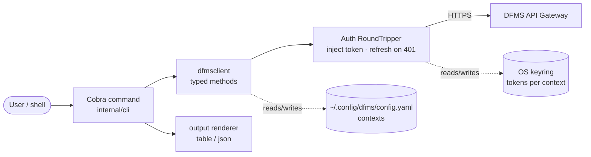

# DFMS CLI (`dfmsctl`) — Design Overview

> Status: **Proposed** · Owner: TBD · Last updated: 2026-06-22
>
> This document describes *what* the DFMS command-line client is and *how* it is
> structured. The step-by-step build plan lives in
> [CLI_IMPLEMENTATION_PLAN.md](CLI_IMPLEMENTATION_PLAN.md).

---

## 1. Motivation

Today the only way to drive the DFMS API is hand-written `curl` (see the
[README](../README.md) examples). That is fine for smoke tests but a non-starter
for real use: token handling, multipart uploads, streaming downloads, and JSON
wrangling are all manual. `dfmsctl` makes every API capability a first-class,
ergonomic command — `dfmsctl files upload report.pdf` instead of a five-line
`curl` with manual `Authorization` headers.

### Goals
- Cover **100% of the public API surface** (auth, files, folders, versioning,
  multipart, search, storage usage, admin).
- Manage **multiple servers** ("contexts") like `kubectl`/`docker context`.
- Handle auth transparently: login once, tokens stored securely, access tokens
  refreshed automatically.
- Make large-file upload/download "just work" (auto-multipart, progress bars,
  streaming — never buffer a whole file in memory).
- Be **scriptable** (`--output json`, stable exit codes) and **human-friendly**
  (tables, color, completions) at the same time.
- Ship as a **single static binary**, matching the project's existing ethos.

### Non-goals (initial release)
- A TUI/interactive dashboard (possible later).
- Server administration beyond what the API exposes (no direct DB/MinIO access).
- Windows-specific packaging beyond a plain binary (cross-compiles, but no MSI).

---

## 2. Tech Stack

| Concern | Choice | Why |
|---|---|---|
| Language | **Go 1.26** (same module) | Reuse `pkg/models` & `pkg/errors`; single static binary; team fluency |
| CLI framework | **spf13/cobra** | De-facto standard (kubectl, gh, hugo); subcommand tree, help, completions |
| Config | **spf13/viper** | Already a project dependency; flag/env/file precedence for free |
| API client | **Hand-written** `internal/dfmsclient` | Small API surface; full control over streaming/multipart/refresh |
| Token storage | **zalando/go-keyring** + `0600` file fallback | OS keychain first (like `gh`); works headless/CI |
| Password prompt | **golang.org/x/term** | No-echo interactive prompt; keeps secrets out of shell history |
| Progress bars | **vbauerster/mpb** (or `schollz/progressbar`) | Per-file progress for large up/downloads; auto-disable on non-TTY |
| Table output | **jedib0t/go-pretty** (or hand-rolled `text/tabwriter`) | Clean human output; `text/tabwriter` is std-lib if we want zero deps |
| Color | **fatih/color** | Honors `NO_COLOR` and non-TTY automatically |
| Release | **GoReleaser** | Cross-platform binaries, checksums, Homebrew tap, packages |

> Dependency versions are pinned at add-time via `go get`; the table lists the
> library, not a frozen version.

**Reuse, not duplication:** the CLI imports the server's own
[`pkg/models`](../pkg/models/models.go) (`User`, `File`, `StorageNode`, …) and
[`pkg/errors`](../pkg/errors/errors.go) (stable error codes + envelope). There is
**no separate type definition** and therefore **no drift** between client and
server.

---

## 3. Repository Placement

`dfmsctl` lives **in this repository** as a new binary, not a separate repo.

Rationale: it can import `pkg/models`/`pkg/errors` directly (a separate repo
would have to depend on the whole server module — pulling pgx, kafka, minio —
or duplicate the types). API and client evolve in the same PR, eliminating
lockstep-release pain. `go install` still builds only the one binary. If the CLI
ever needs an independent release cadence, extraction via `git filter-repo` is
mechanical.

### Layout

```
cmd/dfmsctl/
  main.go                 # thin entrypoint: build root cmd, Execute()

internal/cli/             # Cobra command definitions (one file per noun)
  root.go                 # root command, global flags, version
  context.go              # context add|list|use|remove
  auth.go                 # auth register|login|logout|status
  files.go                # files upload|download|list|get|delete|search
  files_versions.go       # files versions list|download|delete
  folders.go              # folders create|contents|move|delete
  storage.go              # storage usage
  admin.go                # admin nodes
  completion.go           # shell completion generators
  output/                 # rendering: table/json/yaml, color, TTY detection

internal/dfmsclient/      # the HTTP client (no Cobra imports here)
  client.go               # client struct, constructor, doRequest
  auth.go                 # register/login/refresh/whoami
  files.go                # file endpoints (incl. streaming up/download)
  multipart.go            # multipart init/part/complete/abort
  folders.go, search.go, storage.go, admin.go
  transport.go            # auth round-tripper (inject token, refresh on 401)
  errors.go               # parse pkg/errors envelope → typed CLI errors

internal/cliconfig/       # CLI config + context store (XDG paths)
  config.go               # load/save ~/.config/dfms/config.yaml (typed structs + yaml.v3)
  tokens.go               # keyring + file fallback, keyed by context (Phase 2)
```

> Note the deliberate split: `internal/cli` (presentation, Cobra) depends on
> `internal/dfmsclient` (transport, no Cobra). This keeps the client unit-testable
> in isolation and reusable (e.g. by future automation) without dragging in the
> command framework.

Add `dfmsctl` to the `SERVICES`/build list in the [Makefile](../Makefile) so
`make build` and the Docker matrix pick it up.

---

## 4. High-Level Architecture



Data flow for a typical command:
1. Cobra parses args/flags, resolves the **active context** (flag > env > config).
2. It constructs a `dfmsclient.Client` bound to that context's base URL, wrapping
   the HTTP transport with the **auth round-tripper**.
3. The command calls a typed client method (e.g. `client.UploadFile`).
4. The round-tripper attaches `Authorization: Bearer <access>`; on `401`/expiry it
   transparently calls `/auth/refresh`, stores the new tokens, and retries once.
5. The response (a `pkg/models` type) is handed to the **output renderer**, which
   prints a table or JSON depending on `--output`.

---

## 5. Command Surface → API Mapping

Every command maps to a documented endpoint (see
[api/openapi/openapi.yaml](../api/openapi/openapi.yaml)).

| Command | Method · Path |
|---|---|
| `dfmsctl context add\|list\|use\|remove` | *(local only — no API call)* |
| `dfmsctl auth register` | `POST /api/v1/auth/register` |
| `dfmsctl auth login` | `POST /api/v1/auth/login` |
| `dfmsctl auth refresh` *(usually automatic)* | `POST /api/v1/auth/refresh` |
| `dfmsctl auth status` *(whoami)* | derived from stored token / `GET /storage/usage` |
| `dfmsctl auth logout` | *(local — clears keyring entry)* |
| `dfmsctl files upload <path>` | `POST /api/v1/files/upload` *(auto-multipart for large files)* |
| `dfmsctl files list` | `GET /api/v1/files` |
| `dfmsctl files get <id>` | `GET /api/v1/files/:id` |
| `dfmsctl files download <id>` | `GET /api/v1/files/:id/download` |
| `dfmsctl files delete <id>` | `DELETE /api/v1/files/:id` |
| `dfmsctl files search <query>` | `GET /api/v1/search?q=` |
| `dfmsctl files versions list <id>` | `GET /api/v1/files/:id/versions` |
| `dfmsctl files versions download <id> <ver>` | `GET /api/v1/files/:id/versions/:version/download` |
| `dfmsctl files versions delete <id> <ver>` | `DELETE /api/v1/files/:id/versions/:version` |
| `dfmsctl folders create <name>` | `POST /api/v1/folders` |
| `dfmsctl folders contents <id>` | `GET /api/v1/folders/:id/contents` |
| `dfmsctl folders move <file-id> <folder-id>` | `PUT /api/v1/files/:id/move` |
| `dfmsctl folders delete <id>` | `DELETE /api/v1/folders/:id` |
| `dfmsctl storage usage` | `GET /api/v1/storage/usage` |
| `dfmsctl admin nodes` | `GET /api/v1/admin/nodes` |
| `dfmsctl completion bash\|zsh\|fish\|powershell` | *(local)* |
| `dfmsctl version` | *(local; also probes `GET /health` with `--server`)* |

**Multipart is hidden:** the four multipart endpoints are an implementation
detail of `files upload`, selected automatically when a file exceeds a threshold
(default 64 MB, configurable). Users never call `multipart` directly.

---

## 6. Configuration & Contexts

Non-secret configuration lives at `~/.config/dfms/config.yaml` (honoring
`$XDG_CONFIG_HOME`). Tokens never appear here.

```yaml
current_context: prod
contexts:
  prod:
    url: https://dfms.example.com
    insecure_skip_verify: false   # opt-in for self-signed dev TLS
  local:
    url: http://localhost:8080
defaults:
  output: table                   # table | json | yaml
  multipart_threshold: 67108864   # 64 MB
```

- `dfmsctl context add prod --url https://dfms.example.com`
- `dfmsctl context use prod`
- Per-invocation override: `--context local` / `-c local`, or `DFMSCTL_CONTEXT=local`.

**Precedence** (highest → lowest): command-line flag → `DFMSCTL_*` env var →
config file → built-in default. The persistent file is read/written as typed
structs via `yaml.v3` (cleaner than Viper for structured read-modify-write, as
kubectl/gh do); the flag/env/file precedence is resolved explicitly in the
command layer.

---

## 7. Authentication & Token Lifecycle

The API issues an **access token** (`expires_in: 900` = 15 min) and a **refresh
token** (7 days) on login. `dfmsctl` manages both so the user authenticates once.

### Storage
- Primary: **OS keyring** via `go-keyring` (macOS Keychain / Linux Secret Service
  / Windows Credential Manager), keyed `dfms:<context-name>`.
- Fallback: `~/.config/dfms/tokens.json`, mode `0600`, when no keyring backend is
  available (headless servers, CI). The active store is chosen at runtime.

### Flows
- **login:** prompt for password with no-echo (`x/term`); support `--password-stdin`
  and `DFMSCTL_PASSWORD` for automation; store both tokens for the active context.
- **transparent refresh:** the auth round-tripper checks access-token expiry
  (decode `exp` locally) before each request; on expiry, or on a `401` with code
  `AUTH_TOKEN_EXPIRED`, it calls `/auth/refresh`, persists new tokens, and retries
  the original request **once**. If refresh fails → clear, prompt re-login.
- **logout:** delete the context's keyring/file entry. No API call (stateless JWT).
- **status:** decode the stored token locally (email, role, expiry) without a
  round-trip; `--server` flag verifies against the API.

### Rules
- Never accept `--password` as a flag (leaks into history/`ps`).
- Never log tokens; redact `Authorization` in `--verbose`/debug dumps.
- Treat `insecure_skip_verify` as explicit, per-context opt-in — warn loudly.

---

## 8. API Client Design (`internal/dfmsclient`)

A small, dependency-light client that owns all HTTP concerns. **No Cobra imports.**

- **Typed methods** returning `pkg/models` types, e.g.
  `UploadFile(ctx, name string, r io.Reader, size int64) (*models.File, error)`.
- **Context-aware**: every method takes `context.Context`; honors cancellation and
  a configurable per-request timeout (uploads/downloads get a longer/none).
- **Auth round-tripper** (`transport.go`): injects the bearer token and performs
  the refresh-and-retry dance described above. Implemented as `http.RoundTripper`
  so it composes with the standard client.
- **Retries**: exponential backoff on network errors and `5xx`/`429`
  (respect `Retry-After`), **idempotent verbs only** — never auto-retry a
  non-idempotent `POST upload`.
- **Streaming, never buffering**:
  - Upload sends the file as a `multipart/form-data` request (field `file`),
    with the body produced through an `io.Pipe` so the file is streamed from disk
    rather than buffered — this matches the server's actual
    [upload handler](../cmd/api-gateway/main.go) (`c.Request.FormFile("file")`),
    not the octet-stream form suggested by the README.
  - Download streams the response body to disk with `io.Copy`, written to a temp
    file and atomically renamed into place (server-provided names are sanitized
    with `filepath.Base` against path traversal).
  - Large files auto-route through the **multipart** flow (init → PUT parts →
    complete), parts read in bounded chunks; resumable abort on failure.
- **Progress**: optional `io.Reader`/`io.Writer` wrapper feeding an `mpb` bar;
  disabled when stdout is not a TTY or `--quiet`.
- **Error mapping** (`errors.go`): non-2xx bodies are decoded into the
  [`pkg/errors`](../pkg/errors/errors.go) envelope and surfaced as typed errors
  carrying `code`, `message`, and `request_id`.

---

## 9. Output, UX & Exit Codes

### Output
- **Default**: human tables (TTY-aware), e.g. `files list` → ID, name, size,
  version, modified.
- `--output json` / `-o json` (and `yaml`): raw structured output for scripting;
  emits the `pkg/models` JSON verbatim.
- `--quiet` / `-q`: IDs only (pipe-friendly).
- Color via `fatih/color`, auto-disabled on non-TTY or `NO_COLOR`.

### Exit codes (scriptability)
Mapped from `pkg/errors` domains so scripts can branch:

| Code | Meaning | Source |
|---|---|---|
| 0 | Success | — |
| 1 | Generic/unexpected error | — |
| 2 | Usage error (bad flags/args) | Cobra |
| 3 | Network / server unreachable | transport |
| 4 | Authentication required/failed | `AUTH_*` |
| 5 | Not found | `FILE_NOT_FOUND` |
| 6 | Quota exceeded | `QUOTA_EXCEEDED` |
| 7 | Rate limited | `RATE_LIMIT_EXCEEDED` |

Every error message includes the server `request_id` when present, so users can
quote it for support/log correlation.

---

## 10. Security Considerations

- Tokens in OS keyring by default; `0600` file fallback; never in the YAML config.
- No password flags; no token logging; `Authorization` redacted in verbose output.
- TLS verification on by default; `insecure_skip_verify` is explicit per context
  and emits a warning on every use.
- Respect server-side rate limits; surface `429`/`Retry-After` rather than
  hammering.
- Config and token files created with restrictive permissions; directories `0700`.

---

## 11. Distribution & Versioning

- `go install github.com/AnirudhSinghRajora/DFMS/cmd/dfmsctl@latest` for Go users.
- **GoReleaser** produces cross-platform archives, `checksums.txt`, a Homebrew tap,
  and (later) `.deb`/`.rpm`. Triggered on git tag in CI.
- Version metadata injected via `-ldflags "-X main.version=… -X main.commit=…"`,
  consistent with the existing `GOFLAGS` in the [Makefile](../Makefile).
- Shipped artifacts include generated shell completions and man pages.
- `dfmsctl version` prints version, commit, build date, and (with `--server`) the
  target API's `/health` version.

---

## 12. Example Workflows

```bash
# One-time setup
dfmsctl context add prod --url https://dfms.example.com
dfmsctl context use prod
dfmsctl auth register --email me@example.com --display-name "Me"   # prompts for password
# ...or
dfmsctl auth login --email me@example.com                          # prompts; stores tokens

# Everyday use (access token auto-refreshes; no re-login)
dfmsctl files upload ./report.pdf                 # progress bar; auto-multipart if large
dfmsctl files list
dfmsctl files search report
dfmsctl files download <id> -o ./report.pdf
dfmsctl files versions list <id>
dfmsctl storage usage

# Scripting
dfmsctl files list -o json | jq '.files[].id'
dfmsctl files upload big.iso -q                   # prints only the new file ID

# Switch servers per command
dfmsctl -c local files list
```

---

## 13. Open Decisions

These are the forks to settle before/while building (tracked in the plan):

1. **Binary name** — `dfmsctl` (kubectl-style, recommended) vs `dfms` vs both
   (alias). Affects completion names and Homebrew formula.
2. **Table library** — `jedib0t/go-pretty` (nice) vs std-lib `text/tabwriter`
   (zero new deps). Leaning std-lib to keep the dependency surface minimal.
3. **Token store default** — keyring-first with file fallback (recommended) vs
   file-only for simplicity in v1.
4. **OpenAPI codegen** — keep the client hand-written (recommended) vs generate
   types with `oapi-codegen` from the spec. Streaming endpoints favor hand-written.
5. **Distribution scope for v1** — `go install` + GoReleaser binaries only, or also
   a Homebrew tap on day one.

See [CLI_IMPLEMENTATION_PLAN.md](CLI_IMPLEMENTATION_PLAN.md) for the phased build.
