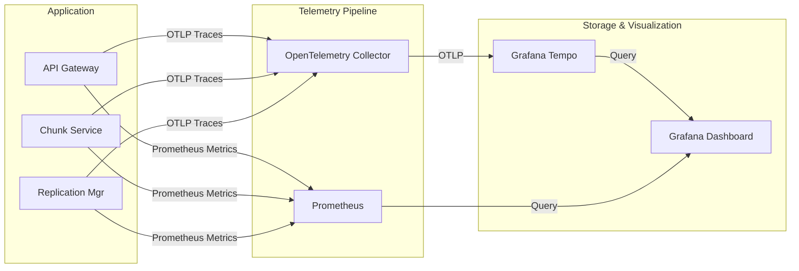

# Observability

## Overview

DFMS is built with a comprehensive observability stack based on **OpenTelemetry** for distributed tracing and **Prometheus** for metrics. This provides deep visibility into the performance, health, and behavior of the distributed system.

## The Observability Stack



## Metrics (Prometheus)

Every service exposes a `/metrics` endpoint that Prometheus scrapes periodically.

### Key Custom Metrics

| Metric Name | Type | Description | Labels |
|:---|:---|:---|:---|
| `dfms_http_requests_total` | Counter | Total HTTP requests | `method`, `path`, `status` |
| `dfms_http_request_duration_seconds`| Histogram | HTTP request latency | `method`, `path` |
| `dfms_grpc_requests_total` | Counter | Total gRPC requests | `method`, `status` |
| `dfms_grpc_request_duration_seconds`| Histogram | gRPC request latency | `method` |
| `dfms_chunks_processed_total` | Counter | Chunks created/deduped | `status` (new/dedup) |
| `dfms_chunk_size_bytes` | Histogram | Size of chunks generated | |
| `dfms_storage_used_bytes` | Gauge | Total storage used per node| `node_id` |
| `dfms_replication_lag` | Gauge | Unreplicated chunks in queue| |
| `dfms_gc_orphans_deleted_total` | Counter | Chunks removed by GC | |

### Grafana Dashboards

The system includes pre-configured Grafana dashboards (provisioned automatically) to monitor:
1. **API Gateway Traffic**: Request rates, 4xx/5xx error rates, p95/p99 latencies
2. **Storage Nodes**: Capacity utilization, node health status, chunk distribution
3. **Replication & GC**: Replication backlog, orphan chunks identified vs deleted
4. **Go Runtime**: Goroutine counts, heap usage, GC pause times

## Distributed Tracing (OpenTelemetry)

DFMS uses context propagation to trace a single request across multiple services.

### Trace Propagation Flow

```
1. Client request arrives at API Gateway
   → Gateway creates a new Trace ID (e.g., "4bf92f3577b34da6a3ce929d0e0e4736")
   → Starts "HTTP POST /api/v1/files/upload" span

2. Gateway calls PostgreSQL (Auth/Metadata)
   → Child spans: "pgx.Query (SELECT user)", "pgx.Exec (INSERT file)"

3. Gateway calls Chunk Service via gRPC
   → Trace ID is injected into gRPC metadata (headers)
   → Chunk Service extracts Trace ID
   → Starts child span "gRPC ChunkAndStore"

4. Chunk Service uploads to MinIO
   → Child spans: "S3 HeadObject", "S3 PutObject"
   → All tied to the original Trace ID
```

### Finding Traces in Grafana Tempo

You can query traces in Grafana by:
- **Trace ID**: Included in every log message (if applicable) and returned in HTTP error responses
- **Service Name**: Filter by `api-gateway` or `chunk-service`
- **Duration**: Find traces taking > 2 seconds
- **Status**: Find traces containing errors

## Structured Logging

DFMS uses `slog` (the standard Go structured logger) configured to output JSON in production and readable text in development.

### Log Format

**Production (JSON):**
```json
{
  "time": "2026-05-23T10:15:30.123Z",
  "level": "INFO",
  "msg": "chunk replicated successfully",
  "service": "replication-manager",
  "trace_id": "4bf92f3577b34da6a3ce929d0e0e4736",
  "chunk_hash": "a1b2c3d4...",
  "target_node": "minio-2",
  "duration_ms": 45
}
```

### Correlation

Every log message generated within an HTTP or gRPC request context automatically includes the `trace_id`. This allows you to find a single error log, copy the `trace_id`, and immediately pull up the full distributed trace in Grafana Tempo to see exactly what led up to the error.
