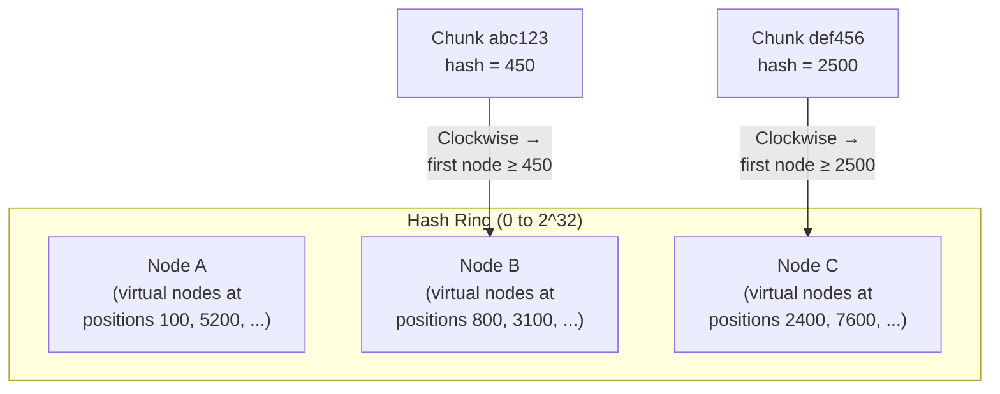
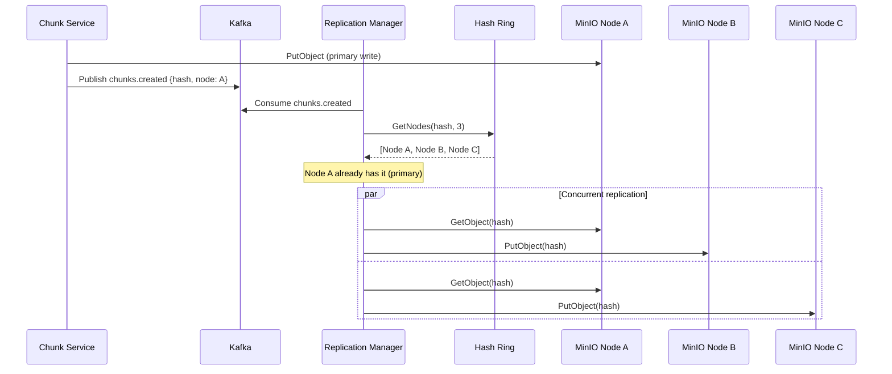
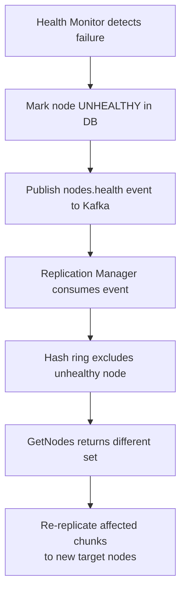
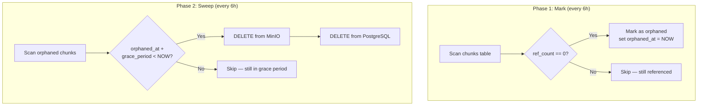

# Replication & Data Distribution

## Overview

DFMS replicates every chunk to **3 storage nodes** (configurable via `replication.factor`) using a **consistent hashing ring**. This ensures that:
- No single node failure causes data loss
- Adding/removing nodes only migrates a predictable fraction of chunks
- Load is distributed proportionally across nodes

## Consistent Hashing Ring

### Why Not Simple Modulo Hashing?

```
Simple modulo: node = hash(chunk) % num_nodes

Problem: Adding a node changes num_nodes, which changes the assignment
         for MOST keys. With 4→5 nodes, ~80% of keys move.

Consistent hashing: node = ring.lookup(hash(chunk))

Advantage: Adding a node only moves ~1/N of keys (where N = total nodes).
           With 4→5 nodes, only ~20% of keys move.
```

### How It Works



1. Each physical node is mapped to **150 virtual nodes** on the ring (evenly distributed)
2. Each chunk's SHA-256 hash is mapped to a position on the ring
3. The chunk is assigned to the **first N distinct physical nodes** found clockwise from its position (where N = replication factor)

### Virtual Nodes

Without virtual nodes, distribution depends heavily on where a few node hashes land — easily skewed. Virtual nodes solve this:

```
Physical node "minio-1" → 150 virtual positions on the ring
Physical node "minio-2" → 150 virtual positions on the ring
Physical node "minio-3" → 150 virtual positions on the ring

Total: 450 positions → much more uniform distribution
```

With 150 virtual nodes per physical node, our tests show **< 35% deviation** from perfect uniformity across 10,000 keys.

### Weighted Nodes

Nodes with more storage capacity can receive proportionally more chunks by setting a higher `weight`:

```yaml
nodes:
  - id: minio-large
    weight: 200    # Gets ~2x the chunks
  - id: minio-small
    weight: 100    # Gets ~1x the chunks
```

Weight is implemented by assigning `weight / 100 * virtual_nodes` virtual positions to each node.

## Replication Flow



### Bounded Concurrency

The Replication Manager uses a **semaphore** to limit concurrent replication tasks. This prevents overwhelming storage nodes during bulk uploads or recovery:

```go
sem := make(chan struct{}, maxConcurrency)  // e.g., 10

for chunk := range events {
    sem <- struct{}{}  // Acquire
    go func() {
        defer func() { <-sem }()  // Release
        replicate(chunk)
    }()
}
```

## Node Failure Handling

### Detection

The **Health Monitor** probes each MinIO node every 30 seconds with a read/write test:

```
1. Write test object: PUT /health-check/probe-{timestamp}
2. Read it back:      GET /health-check/probe-{timestamp}
3. Delete it:         DELETE /health-check/probe-{timestamp}

If any step fails or takes > 5s → mark node as UNHEALTHY
```

### Response

When a node is marked unhealthy:



### Recovery

When a node comes back online:
1. Health Monitor detects it's healthy again
2. Node is re-added to the hash ring
3. No immediate data migration — the ring naturally routes new writes to it
4. Excess replicas on other nodes are cleaned up by the GC Worker over time

## Garbage Collection

### The Problem

Chunks become orphaned when:
- A file is deleted (all its chunks may lose their last reference)
- A file version is deleted
- A multipart upload is aborted

### Two-Phase Mark-Sweep



### Grace Period

The 24-hour grace period (configurable) prevents a race condition:

```
Without grace period:
  T=0s: Upload starts, chunk created (ref_count=1)
  T=1s: GC scans, sees ref_count=0 (file_chunks row not yet inserted)
  T=2s: GC deletes chunk ← DATA LOSS
  T=3s: Upload finishes, file_chunks row inserted → references deleted chunk

With 24h grace period:
  T=0s: Upload starts, chunk created (ref_count=1)
  T=1s: GC scans, marks as orphaned (orphaned_at = now)
  T=3s: Upload finishes, ref_count > 0, orphan mark cleared
  T=24h: GC would sweep, but ref_count > 0 → skip
```

### Reference Counting

```sql
-- On upload (chunk exists): increment
UPDATE chunks SET ref_count = ref_count + 1 WHERE sha256_hash = $1;

-- On file delete: decrement
UPDATE chunks SET ref_count = ref_count - 1
WHERE id IN (SELECT chunk_id FROM file_chunks WHERE file_id = $1);

-- GC mark: find orphans
SELECT id FROM chunks WHERE ref_count = 0 AND orphaned_at IS NULL;

-- GC sweep: delete expired orphans
DELETE FROM chunks
WHERE ref_count = 0
  AND orphaned_at < NOW() - INTERVAL '24 hours';
```
